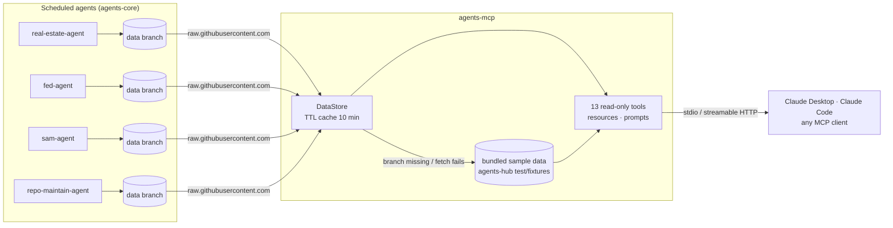

# agents-mcp

A **read-only** [Model Context Protocol](https://modelcontextprotocol.io) server that lets
Claude (and any other MCP client) query the **Agents Hub**: four scheduled data agents
that publish JSON to a `data` branch in their own repos.

| Agent | Repo | What it publishes |
|---|---|---|
| Real Estate Market | [`real-estate-agent`](https://github.com/Kghaffari26/real-estate-agent) | 50 largest U.S. metros: prices, inventory, days on market, price cuts, rents, permits, temperature, flags, affordability, briefs |
| Macro & Fed | [`fed-agent`](https://github.com/Kghaffari26/fed-agent) | ~24 FRED indicators, regimes, yield curve, FOMC decision + statement diff + AI read, release calendar |
| Grants & Contracts | [`sam-agent`](https://github.com/Kghaffari26/sam-agent) | SAM.gov / Grants.gov opportunities scored for a small software consultancy |
| Repo Maintenance | [`repo-maintain-agent`](https://github.com/Kghaffari26/repo-maintain-agent) | Repo health scores, issue triage, stale PRs, drafted changelogs |

The website for the same data is [agents-hub](https://github.com/Kghaffari26/agents-hub).

## Why MCP

The agents already do the hard part: they fetch the sources, compute every number in
Python, and write guarded narratives. MCP makes that data available *inside a
conversation*, so you can ask "compare Tampa and Orlando for a buyer" or "what grants
close in two weeks?" and get an answer built from the published numbers, with citations,
instead of numbers the model half-remembers. One server works with Claude Desktop, Claude
Code and any other MCP client.

The server is strictly read-only: every tool is annotated `readOnlyHint: true`, it only
issues HTTP GETs to `raw.githubusercontent.com`, and it has no write paths.

**Numbers come only from the data.** Tools return the agents' published values verbatim.
The only arithmetic the server does is deterministic code (mortgage amortization,
days-until-deadline, filtering and sorting), never a model.

Every response includes:

- `sample` — `true` if any of it came from bundled sample data (see [Data](#data)),
- `data_through` and `last_run` — how current the data is,
- `sources` — the upstream sources (Redfin, Zillow, FRED, the Fed, SAM.gov, GitHub…) and
  per-item links, and `data_files` — the exact JSON files read.

## Tools

| Tool | Agent | Use it for | Key arguments |
|---|---|---|---|
| `list_agents` | all | Status, last run, staleness, headline and key stats for each agent | — |
| `get_metro` | real estate | One metro's full snapshot: every metric with YoY/MoM, temperature, flags, affordability, brief | `metro` (fuzzy: "NYC", "Austin, TX", `austin-tx`), `include_series` |
| `compare_metros` | real estate | 2–3 metros side by side | `metros`, `metrics` |
| `find_metros` | real estate | Screen/rank the 50 metros | `temperature`, `flags`, `market_type`, `filters` (metric/op/value), `sort_by`, `sort_field`, `limit` |
| `affordability` | real estate | Monthly P&I payment, payment-to-income, vs a year ago | `metro`, `down_payment_pct`, `rate` (default: latest 30-yr), `price`, `term_years` |
| `get_indicators` | macro | Dashboard of latest readings + regimes + brief | `group` (inflation, labor, growth, rates, sentiment) |
| `get_indicator` | macro | One indicator with history | `indicator` (id, FRED id or name), `range`, `start`, `end` |
| `get_fomc` | macro | Latest FOMC decision, statement edits, AI read with tone | `include_statement_text` |
| `upcoming_releases` | macro | Economic calendar for the next N days (+ next FOMC) | `days` |
| `search_opportunities` | grants | Find contracts/grants | `query`, `min_fit`, `closing_within_days`, `source`, `set_aside`, `recommendation`, `sort`, `limit` |
| `get_opportunity` | grants | One opportunity in full: sub-scores, reasons, red flags, pursuit summary | `id` (id, hash, solicitation number or title) |
| `get_repo_health` | repos | Health of one or all watched repos, stale PRs, changelog | `repo` (optional) |
| `get_triage_queue` | repos | Untriaged issues by priority with suggested labels and planned actions | `repo`, `priority`, `classification`, `limit` |

Affordability uses standard fixed-rate amortization, `P·r / (1 − (1+r)^−n)`: a $400,000
loan at 6.5% for 30 years is **$2,528.27**/month, and with the agent's own assumptions it
reproduces the agent's published payments to the cent.

### Resources

- `agents://{agent}/latest.json` and `agents://{agent}/manifest-entry.json` for
  `real_estate`, `macro`, `grants`, `repo_maint` (8 resources),
- `agents://real_estate/metros/{slug}.json` (template).

Each is returned as `{"sample": bool, "source_url": "...", "content": <the file>}`.

### Prompts

| Prompt | Arguments | What it does |
|---|---|---|
| `weekly_market_brief` | `metro` | Weekly market brief for a metro (get_metro + affordability + next week's releases) |
| `economy_this_week` | — | What changed in the economy this week (indicators + FOMC + calendar) |
| `grant_pursuit_shortlist` | `focus`, `min_fit`, `closing_within_days` | Shortlist of contracts/grants to pursue, with next steps |

## Install

Requires [uv](https://docs.astral.sh/uv/). Nothing to clone:

```bash
uvx --from git+https://github.com/Kghaffari26/agents-mcp agents-mcp --help
```

### Claude Code

```bash
claude mcp add agents-hub -- uvx --from git+https://github.com/Kghaffari26/agents-mcp agents-mcp
```

Add `--scope user` to make it available in every project. Check it with `claude mcp list`,
or `/mcp` inside Claude Code.

### Claude Desktop

Settings → Developer → Edit Config, then add to `claude_desktop_config.json`:

```json
{
  "mcpServers": {
    "agents-hub": {
      "command": "uvx",
      "args": ["--from", "git+https://github.com/Kghaffari26/agents-mcp", "agents-mcp"]
    }
  }
}
```

Restart Claude Desktop; the tools appear under the connector menu.

### Streamable HTTP

```bash
uvx --from git+https://github.com/Kghaffari26/agents-mcp agents-mcp \
  --transport streamable-http --host 127.0.0.1 --port 8000
# endpoint: http://127.0.0.1:8000/mcp  (stateless, JSON responses)
claude mcp add --transport http agents-hub http://127.0.0.1:8000/mcp
```

### Configuration

| Env var | Default | Meaning |
|---|---|---|
| `AGENTS_MCP_OFFLINE` | unset | `1` = never touch the network; serve bundled sample data (same as `--offline`) |
| `AGENTS_MCP_CACHE_TTL` | `600` | Seconds to cache each fetched file |
| `AGENTS_MCP_FAILURE_TTL` | `60` | Seconds to remember a failed fetch before retrying |
| `AGENTS_MCP_HTTP_TIMEOUT` | `10` | Per-request timeout (seconds) |
| `AGENTS_MCP_RAW_BASE` | `https://raw.githubusercontent.com` | Base URL for data-branch files |

## Example conversations

These use the bundled sample data, so each answer says so.

**1. "Should a buyer look at Tampa or Orlando right now?"** → `compare_metros`

> Both are buyer's markets (temperature: Cold, 8 for Tampa and 9 for Orlando). Tampa's
> median sale price is $408,300 (−4.4% YoY) vs Orlando's $430,800 (−4.67%). Inventory is up
> 30.9% YoY in Tampa and 28.21% in Orlando, with 7.1 vs 6.7 months of supply, and 9.89% vs
> 9.55% of listings had price drops. Tampa is slightly further into buyer's territory.
> *Data through 2026-08-31 (Redfin Data Center, Zillow Research). Sample data.*

**2. "What would the median Austin home cost me per month with 20% down?"** → `affordability`

> At Austin's median sale price of $465,100 with 20% down ($372,080 loan) at the latest
> 30-year rate of 6.18%, principal and interest is **$2,274.05/month**, about 28.1% of
> Austin's median household income ($97,100, 2024). A year ago the same purchase
> ($483,000 at 6.7%) was $2,493.35, so it's 8.8% cheaper now. Excludes taxes, insurance and
> PMI. *Rates as of 2026-09-24 (FRED MORTGAGE30US). Sample data.*

**3. "Find cloud-migration contracts with a fit of 80+."** → `search_opportunities`

> Two matches, both rated **Pursue**:
> 1. *Cloud Modernization Support Services*, Veterans Affairs, fit 86, due 2026-10-15
>    (19 days), total small business set-aside.
> 2. *Legacy Application Modernization (.NET to Cloud)*, Homeland Security, fit 82, due
>    2026-10-12 (16 days).
>
> Want the full pursuit summary for either? (`get_opportunity`) *Automated screening:
> always read the official notice. Sample data.*

## Architecture



## Data

Files follow the data-branch contract in the
[agents-core README](https://github.com/Kghaffari26/agents-core#the-data-branch-contract)
and the §6 JSON shapes in the
[agents-hub specs](https://github.com/Kghaffari26/agents-hub/tree/main/docs/specs):
`latest.json`, `manifest-entry.json`, plus `metros/<slug>.json` (real estate) and
`all.json` (grants), read from
`https://raw.githubusercontent.com/<repo>/data/<path>`.

Fetched files are cached in memory for 10 minutes. If an agent's `latest.json` can't be
read (the `data` branch doesn't exist yet, a network error, invalid JSON), that agent
switches to the sample data bundled from agents-hub's `test/fixtures/<agent>/`, and
every response that used it has `"sample": true` and a `sample_note`. Relative-date
filters (`closing_within_days`, `upcoming_releases`) count from today for live data and
from the snapshot's run date for sample data.

## Eval: does Claude pick the right tool?

`evals/questions.json` holds 25 natural-language questions, each with the expected tool
and checks on the key arguments (e.g. the metro resolves to `austin-tx`, `min_fit` is 80,
`group` is omitted). `evals/run_eval.py` fetches the tool list from the real server over
MCP, sends each question to Claude as a single turn, scores the first tool call, and
writes `evals/results/<date>.json` and a line in `evals/history.jsonl`.

| Date | Commit | Model | Tool choice | Arguments | Fully correct | Cost |
|---|---|---|---|---|---|---|
| 2026-09-26 | `39a882c` | `claude-opus-5` (effort low) | 25/25 (100%) | 100% | 25/25 | $0.20 |

```bash
uv run --group evals python -m evals.run_eval --dry-run      # validate only, free
uv run --group evals python -m evals.run_eval --max-usd 0.50 # needs ANTHROPIC_API_KEY
```

The key is read from `ANTHROPIC_API_KEY`, falling back to `AGENTS_ANTHROPIC_API_KEY`.
The run has a hard spend cap: before each request the worst case (full-price input plus
`max_tokens` of output) must fit in the remaining budget. In CI the eval runs only via
the manual *Tool-selection eval* workflow.

## Development

```bash
uv sync
uv run pytest            # unit tests (mocked HTTP) + in-process MCP integration tests
uv run ruff check . && uv run ruff format --check .
uv run agents-mcp --offline   # stdio server on sample data
```

See [CLAUDE.md](CLAUDE.md) for conventions, [STATUS.md](STATUS.md) for current state and
[DECISIONS.md](DECISIONS.md) for design choices.
